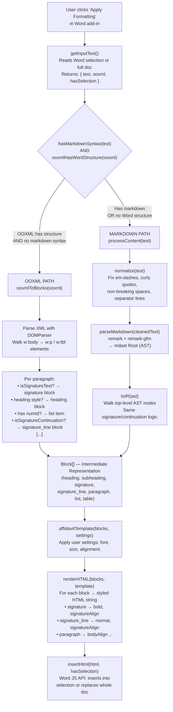

```mermaid
flowchart TD
    A["User clicks 'Apply Formatting'<br/>in Word add-in"] --> B["getInputText()<br/>Reads Word selection or full doc<br/>Returns: { text, ooxml, hasSelection }"]

    B --> C{"hasMarkdownSyntax(text)<br/>AND<br/>ooxmlHasWordStructure(ooxml)"}

    C -->|"OOXML has structure<br/>AND no markdown syntax"| D["OOXML PATH<br/>ooxmlToBlocks(ooxml)"]
    C -->|"Has markdown<br/>OR no Word structure"| E["MARKDOWN PATH<br/>processContent(text)"]

    D --> D1["Parse XML with DOMParser<br/>Walk w:body → w:p / w:tbl elements"]
    D1 --> D2["Per paragraph:<br/>• isSignatureText? → signature block<br/>• heading style? → heading block<br/>• has numId? → list item<br/>• isSignatureContinuation? → signature_line block<br/>[...] "]
    D2 --> IR["Block[] — Intermediate Representation<br/>(heading, subheading, signature,<br/>signature_line, paragraph, list, table)"]

    E --> E1["normalize(text)<br/>Fix em-dashes, curly quotes,<br/>non-breaking spaces, separator lines"]
    E1 --> E2["parseMarkdown(cleanedText)<br/>remark + remark-gfm<br/>→ mdast Root (AST)"]
    E2 --> E3["toIR(ast)<br/>Walk top-level AST nodes<br/>Same signature/continuation logic"]
    E3 --> IR

    IR --> F["affidavitTemplate(blocks, settings)<br/>Apply user settings: font, size, alignment"]
    F --> G["renderHTML(blocks, template)<br/>For each block → styled HTML string<br/>• signature → bold, signatureAlign<br/>• signature_line → normal, signatureAlign<br/>• paragraph → bodyAlign ..."]
    G --> H["insertHtml(html, hasSelection)<br/>Word JS API: inserts into<br/>selection or replaces whole doc"]
```
